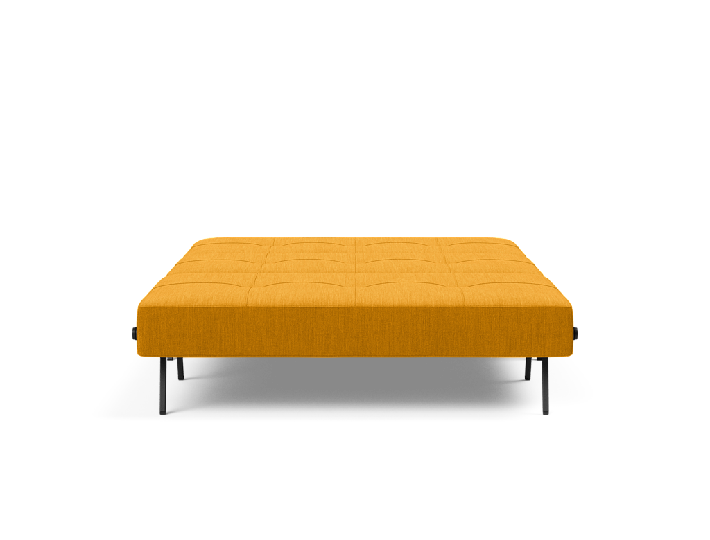
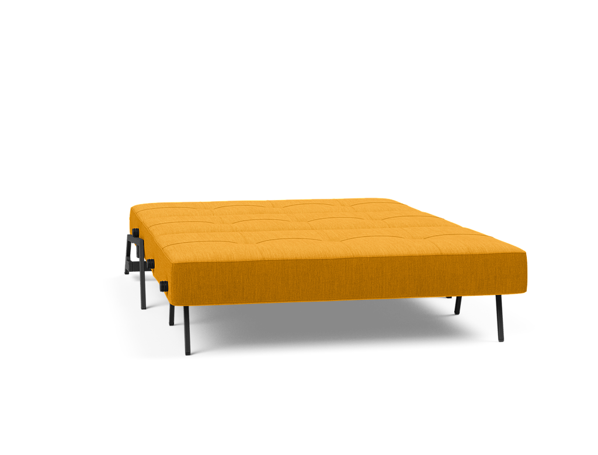
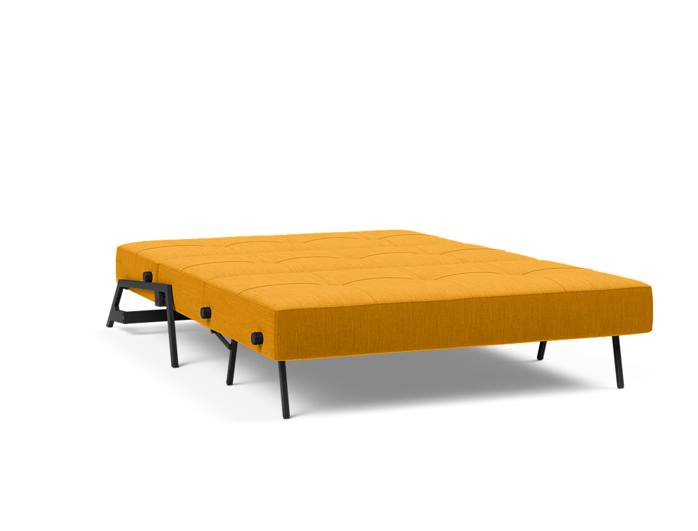
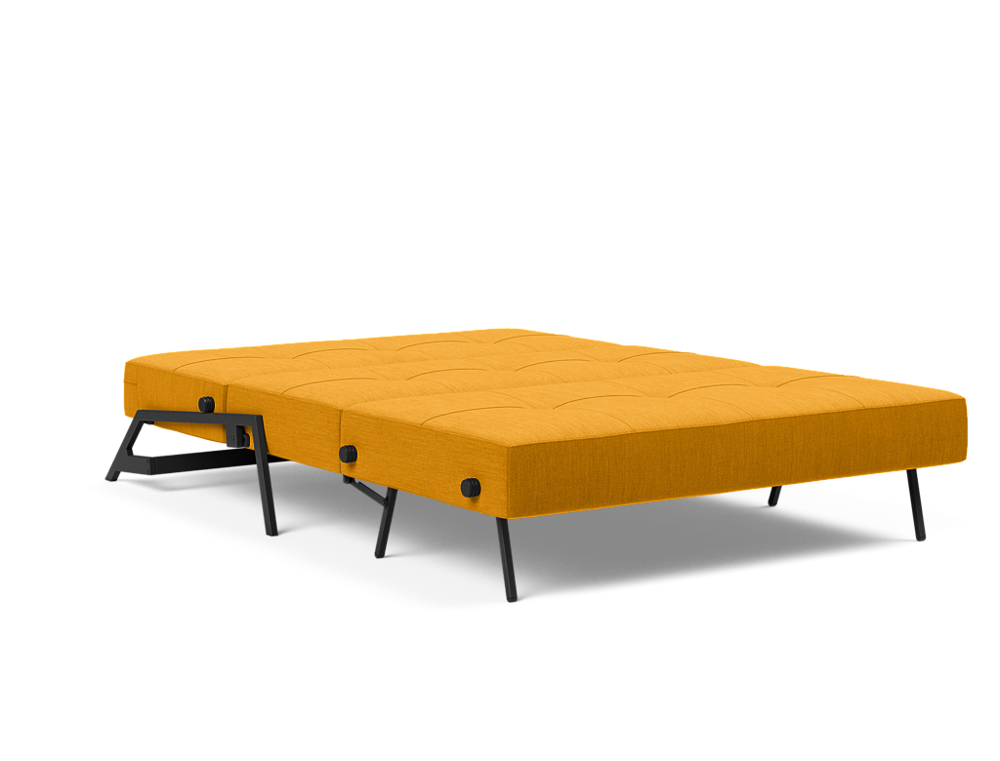
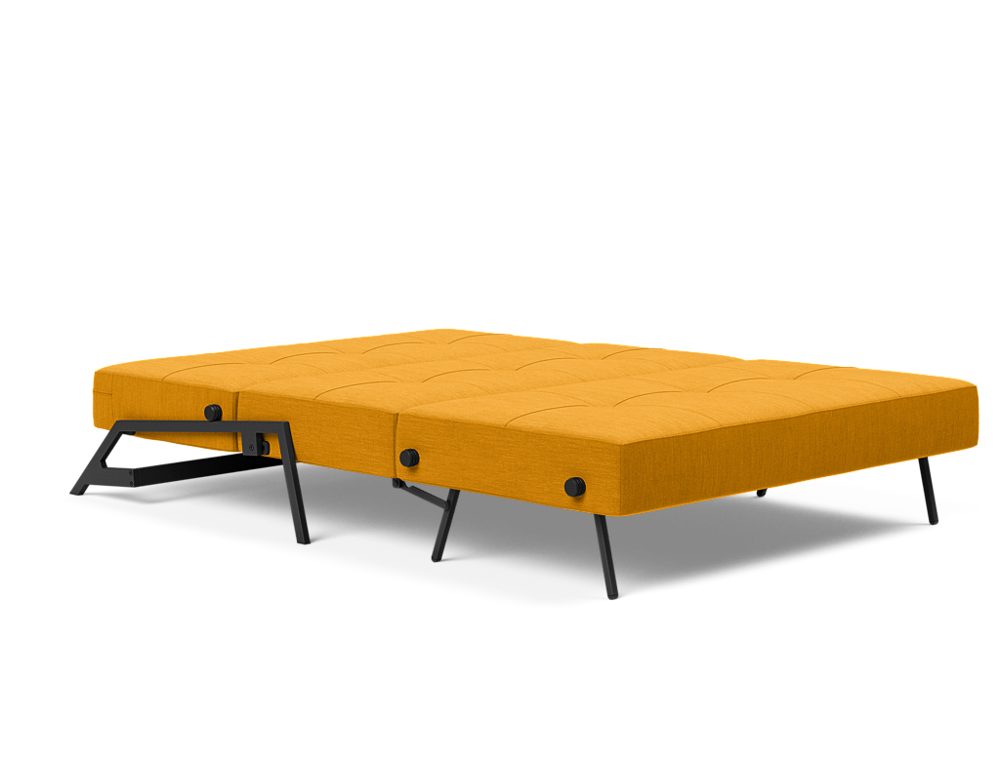

# CoThreeSixty 360 image viewer

## Initialize
- Loading script
- Add web component with required options to page `<co-three-sixty></co-three-sixty>`

The web component can be initiated in multiple ways:

- By using attribute
  - See list of required and optional attributes below
- By using slots
  - Add a `<slot name="imageList">` to the component and add `` elements to this `<slot>`
  - This eliminates the required attributes
- By adding image paths to the option `imageList`
  - Add an array of image paths to either `imageList`-attribute on the component or `imageList`-property in json
  - This eliminates the required attributes
- By json
  - Run the `init` function with a JSON-object argument
  - JSON-object should follow one of the patterns above
  - The attribute `initOnLoad` should be set to false

## Options

- `folder: ''` (Default: Empty string): The folder where the images are located. (Required)

- `filename: ''` (Default: Empty string): The common filename pattern for the images. (Required)

- `amount: 0` (Default: 0): The total number of images. (Required)

- `imageList: []` (Default: Empty array): An array of image URLs. (Optional)

- `startIndex: 0` (Default: 0): The index of the initial image to display. (Optional)

- `spinSpeed: 100` (Default: 100): The speed of auto-spin in milliseconds. (Optional)

- `autoSpin: false` (Default: false): Whether auto-spin is enabled or not. (Optional)

- `debug: false` (Default: false): Whether debugging mode is enabled or not. (Optional)

- `leadingZeroPadding: 0` (Default: 0): The number of leading zeros to pad image filenames with. (Optional)

- `initOnLoad: true` (Default: true): Whether to initialize on page load. (Optional)

- `width: 500` (Default: 500): The width of the canvas. (Optional)

- `height: 500` (Default: 500): The height of the canvas. (Optional)

## Examples

### Only using attributes
```
<co-three-sixty
    folder="./public/img/sofa/"
    filename="{index}.png"
    amount="32"
    start-index="1"
    spin-speed="100"
    auto-spin="false"
    debug="false"
    leading-zero-padding="0"
    init-on-load="true"></co-three-sixty>
```

### Using slots for images (for looping images in html)
```
<co-three-sixty id="co-three-sixty-viewer-slotted"
    start-index="1"
    spin-speed="100"
    init-on-load="true">
        <slot name="imageList">
          
          
          
          
          
          ...
        </slot>
</co-three-sixty>
```

### Load data externally with minimum attributes
```
<co-three-sixty id="co-three-sixty-viewer"
    init-on-load="false">
</co-three-sixty>

<script>
    const dataForViewerJSON = {
      startIndex: 1,
      autoSpin: true,
      leadingZeroPadding: 2,
      imageList:[
          "./public/img/sofa/01.png",
          "./public/img/sofa/02.png",
          "./public/img/sofa/03.png",
          ...
      ]
    };
    
    const viewer = document.querySelector( '#co-three-sixty-viewer' );
    
    document.addEventListener('DOMContentLoaded', () =>{
        viewer.init( dataForViewerJSON )
    }, false);
</script>
```